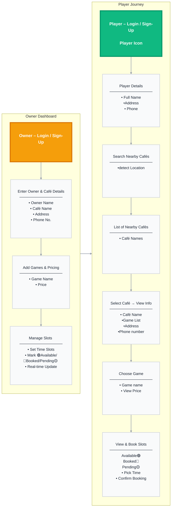
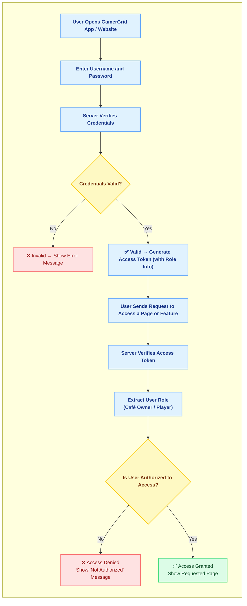
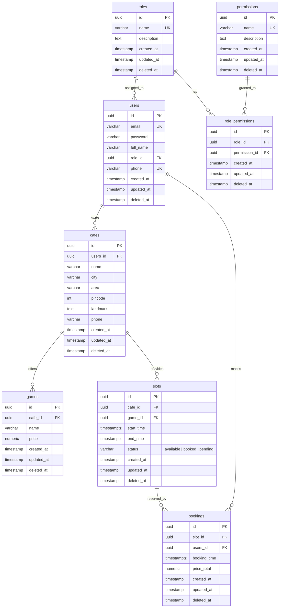
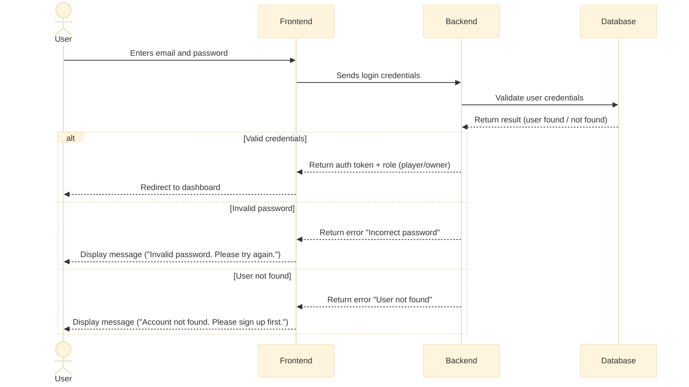
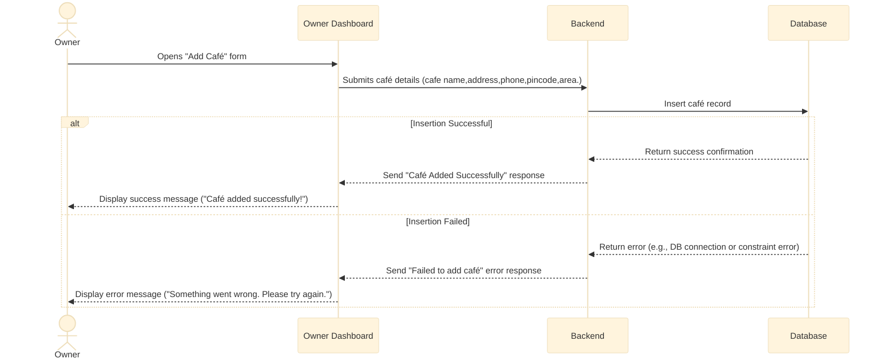
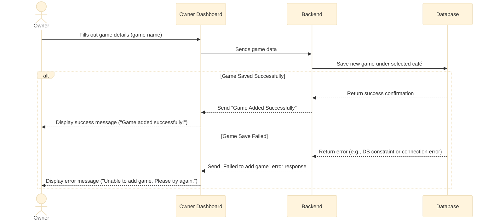
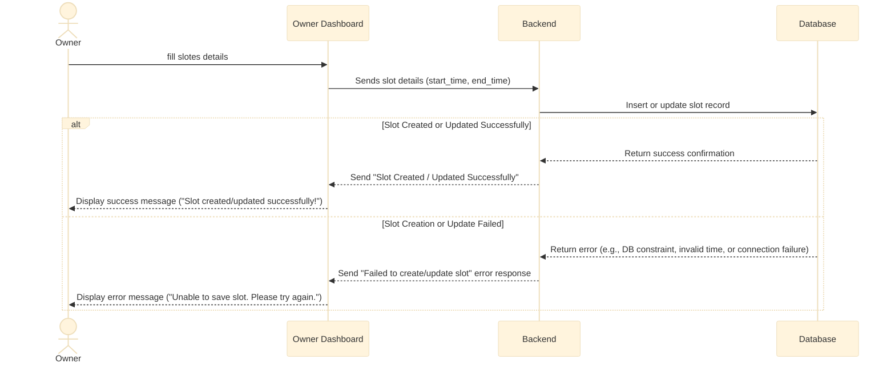
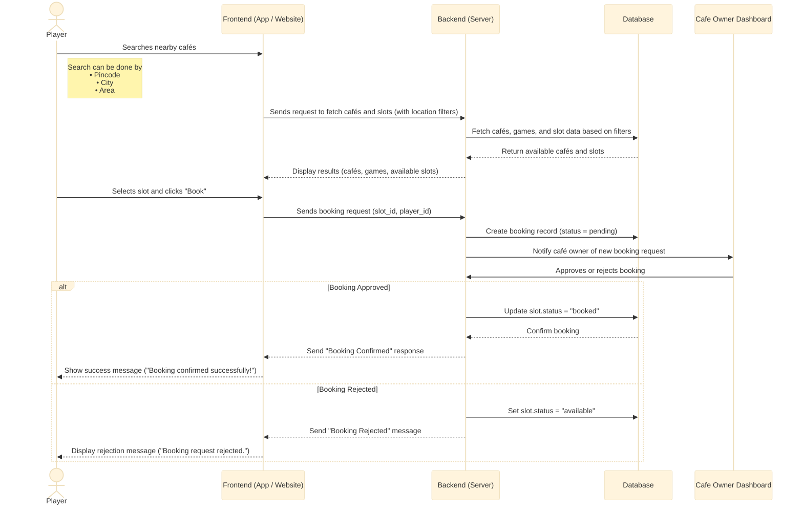

# 🎮 **GamerGrid**

**Smart Gaming Café Management & Slot-Tracking and Booking Platform**

---

## **Introduction**

Players can use **GamerGrid** to find nearby gaming cafés and see which games are available along with their prices.  
They can track slot availability in real time and **book their sessions online** or **contact the café owner directly** to confirm a booking.  

Café owners can view **detailed analytics** about their cafés — such as the most played and least played games,  
the most booked slots, and their **weekly revenue reports** — helping them understand and improve their business performance.


---

## **What GamerGrid Does**

## For Players
- Find nearby gaming cafés.  
- See which games are available and their prices.  
- Track live slot availability.  
- Book slots online or contact the café owner directly.  

## For Café Owners
- Manage games, pricing, and slot schedules.   
- View analytical reports about their cafés.  
- Track most played and least played games, most booked slots, and weekly revenue.  

## For Everyone
- Increases transparency between gamers and cafés.  
- Saves time and reduces confusion.  
- Helps both gamers and café owners coordinate easily and efficiently.

##  **Platform Flow (System Diagram)**


---

## **Authentication Flow**

A user (either a **Player** or a **Café Owner**) enters their **email** and **password** on the login page.
The system verifies the provided credentials in the database.

* If the credentials are **valid**, the system identifies the user’s **role** (`player` or `owner`)
  and redirects them to their respective dashboard:

  * **Players** → redirected to the **Café Discovery & Slot Booking** page.
  * **Café Owners** → redirected to the **Owner Dashboard** for managing cafés, games, and slots.
* If the credentials are **invalid**, an error message such as *“Invalid email or password”* is displayed.

---

## **Authorization Rules**

GamerGrid uses a **Role-Based Access Control (RBAC)** system to manage permissions and access.

* A user’s **role** (Player or Owner) defines what features they can access in the system.
* **Players** can:

  * Search nearby cafés
  * View available games and slots
  * Book slots
* **Café Owners** can:

  * Add and manage cafés
  * Add or edit games
  * Create, update, time slots
 
* Each role is linked to specific **permissions**, which control what actions they can perform and what pages they can access.
* The RBAC model is implemented using three core tables:

  * `roles`
  * `permissions`
  * `role_permissions`


## **Authentication & Authorization Flow**

<br>  <!-- 👈 This line adds space so heading doesn’t overlap the chart -->



## **Functional Use Cases**

### For Players
- Register and log in to their account.  
- Search and discover nearby gaming cafés using pincode,area and city.  
- View café details, available games, and prices.  
- Check real-time slot availability.  
- Book slots online or contact café directly for booking.  

### For Café Owners
- Register as a café owner and log in to their account.  
- Add café details such as name, address, and contact info.  
- Manage games, pricing, and slot schedules.  
- manage player bookings.  
- Access analytical reports — most played games, least played, most booked slots, and weekly revenue.

---

## **Business Use Cases**

- **Easy Café Discovery:**  
   Helps gamers quickly find nearby cafés and see game availability, prices, and open slots.

- **Streamlined Booking Experience:**  
   Reduces manual communication — players can check slots and book directly through the app or contact owners instantly.

- **Digital Café Management:**  
   Helps café owners manage games, pricing, and slot schedules in one place instead of using manual logs.

- **Platform Transparency:**  
   Creates trust between players and cafés by showing real-time availability and verified information.

# Tech Stack

## Frontend

| Technology | Version / Spec | Purpose |
|-------------|----------------|----------|
| **HTML** | HTML5 | Markup for page structure |
| **CSS** | CSS3 (modern features) | Styling, layout (Flexbox / Grid / custom properties) |
| **JavaScript** | Vanilla JS (ES6+) | Client-side behavior, DOM manipulation, AJAX/fetch |
| **Fetch API** | Built-in browser API | HTTP requests (replaces Axios for simple use) |
| **Jest** | Latest | JavaScript testing framework for unit and integration tests |


## Backend

| Technology | Version | Purpose |
|---|---|---|
| Python | v3.12.7 | Programming language |
| FastAPI | v0.121.1 | Modern async web framework |
| SQLAlchemy | v2.0.44 | SQL toolkit and ORM |
| PostgreSQL | v16.6 | Relational database |
| Pytest | v9.0.0 | Testing framework |
| pytest-asyncio | v1.3.0 | Async test support for pytest |
| pytest-cov | v7.0.0 | Code coverage plugin for pytest |
| Uvicorn | v0.38.0 | ASGI server for FastAPI |

## DevOps & Deployment

| Technology | Version | Purpose |
|---|---|---|
| AWS EC2 | - | Application hosting (compute) |
| AWS RDS | - | Managed PostgreSQL database |
| GitHub Actions | - | CI/CD pipeline automation ||

## **Schema Design**

## Database Overview
We use a **PostgreSQL** database to store all user, café, game, booking, and slot data.  
It’s secure, reliable, and perfect for handling real-time gaming café operations.

---

## Entity Relationship Diagram
This diagram shows how the main data tables of **GamerGrid** are connected.



## Table Schemas

---

### 1. users

This table stores all registered users — both **players** and **café owners** — with linked roles.

```sql
CREATE TABLE users (
    id              UUID PRIMARY KEY DEFAULT gen_random_uuid(),
    email           VARCHAR(255) UNIQUE NOT NULL,
    password        TEXT NOT NULL,
    full_name       VARCHAR(150),
    role_id         UUID NOT NULL REFERENCES roles(id) ON DELETE RESTRICT,
    phone           VARCHAR(20) UNIQUE,
    created_at      TIMESTAMP DEFAULT NOW() NOT NULL,
    updated_at      TIMESTAMP DEFAULT NOW() NOT NULL,
    deleted_at      TIMESTAMP
);
```

* **role_id:** Foreign key → links to `roles` table.
* **email:** Used for login, must be unique.
* **phone:** Also unique, helps for verification.
* **deleted_at:** Used for soft deletion (user deactivation).

---

### 2. cafes

This table stores details about each **café owned by a user**.

```sql
CREATE TABLE cafes (
    id              UUID PRIMARY KEY DEFAULT gen_random_uuid(),
    owner_id        UUID NOT NULL REFERENCES users(id) ON DELETE CASCADE,
    name            VARCHAR(200) NOT NULL,
    city            VARCHAR(100),
    area            VARCHAR(100),
    pincode         VARCHAR(10),
    landmark        TEXT,
    phone           VARCHAR(20),
    created_at      TIMESTAMP DEFAULT NOW() NOT NULL,
    updated_at      TIMESTAMP DEFAULT NOW() NOT NULL,
    deleted_at      TIMESTAMP
);
```

* **owner_id:** The user (owner) who registered the café.
* **city, area, pincode:** Used for nearby café searches.
* **Soft delete:** Helps maintain deleted café records.

---

### 3. games

This table lists all **games available in each café**.

```sql
CREATE TABLE games (
    id              UUID PRIMARY KEY DEFAULT gen_random_uuid(),
    cafe_id         UUID NOT NULL REFERENCES cafes(id) ON DELETE CASCADE,
    name            VARCHAR(100) NOT NULL,
    price           NUMERIC(10,2) NOT NULL,
    created_at      TIMESTAMP DEFAULT NOW() NOT NULL,
    updated_at      TIMESTAMP DEFAULT NOW() NOT NULL,
    deleted_at      TIMESTAMP
);
```

* **cafe_id:** Connects each game to a specific café.
* **price:** Price per hour/session.
* **deleted_at:** Marks temporarily removed games.

---

### 4. slots

This table manages all **café time slots** for games (available, pending, booked).

```sql
CREATE TABLE slots (
    id              UUID PRIMARY KEY DEFAULT gen_random_uuid(),
    cafe_id         UUID NOT NULL REFERENCES cafes(id) ON DELETE CASCADE,
    game_id         UUID REFERENCES games(id) ON DELETE SET NULL,
    start_time      TIMESTAMPTZ NOT NULL,
    end_time        TIMESTAMPTZ NOT NULL,
    status          VARCHAR(20) DEFAULT 'available' CHECK (status IN ('available', 'booked', 'pending')),
    created_at      TIMESTAMP DEFAULT NOW() NOT NULL,
    updated_at      TIMESTAMP DEFAULT NOW() NOT NULL,
    deleted_at      TIMESTAMP
);
```

* **cafe_id:** The café that owns the slot.
* **game_id:** The game played during that slot (optional).
* **status:** Slot status — `'available'`, `'pending'`, or `'booked'`.

---

### 5. bookings

This table records all **player bookings** for café slots.

```sql
CREATE TABLE bookings (
    id              UUID PRIMARY KEY DEFAULT gen_random_uuid(),
    slot_id         UUID NOT NULL REFERENCES slots(id) ON DELETE RESTRICT,
    player_id       UUID NOT NULL REFERENCES users(id) ON DELETE CASCADE,
    booking_time    TIMESTAMPTZ DEFAULT NOW() NOT NULL,
    price_total     NUMERIC(10,2),
    created_at      TIMESTAMP DEFAULT NOW() NOT NULL,
    updated_at      TIMESTAMP DEFAULT NOW() NOT NULL,
    deleted_at      TIMESTAMP
);
```

* **slot_id:** The slot being booked.
* **player_id:** The user who booked the slot.
* **price_total:** The total cost of that booking.

---

### 6. roles

This table defines all **user roles** in the system.

```sql
CREATE TABLE roles (
    id              UUID PRIMARY KEY DEFAULT gen_random_uuid(),
    name            VARCHAR(100) UNIQUE NOT NULL,
    description     TEXT,
    created_at      TIMESTAMP DEFAULT NOW() NOT NULL,
    updated_at      TIMESTAMP DEFAULT NOW() NOT NULL,
    deleted_at      TIMESTAMP
);
```

* **name:** Role name (`player`, `owner`, `admin`).
* **description:** Explains what this role can do.

---

### 7. permissions

This table defines all **actions or privileges** that can be assigned to roles.

```sql
CREATE TABLE permissions (
    id              UUID PRIMARY KEY DEFAULT gen_random_uuid(),
    name            VARCHAR(150) UNIQUE NOT NULL,
    description     TEXT,
    created_at      TIMESTAMP DEFAULT NOW() NOT NULL,
    updated_at      TIMESTAMP DEFAULT NOW() NOT NULL,
    deleted_at      TIMESTAMP
);
```

* **name:** The action name (e.g., `'create_slot'`, `'book_cafe'`).
* **description:** Describes what that permission allows.

---

### 8. role_permissions

This **junction table** connects `roles` and `permissions` (many-to-many).

```sql
CREATE TABLE role_permissions (
    id              UUID PRIMARY KEY DEFAULT gen_random_uuid(),
    role_id         UUID NOT NULL REFERENCES roles(id) ON DELETE CASCADE,
    permission_id   UUID NOT NULL REFERENCES permissions(id) ON DELETE CASCADE,
    created_at      TIMESTAMP DEFAULT NOW() NOT NULL,
    updated_at      TIMESTAMP DEFAULT NOW() NOT NULL,
    deleted_at      TIMESTAMP
);
```

* **role_id:** The role being assigned a permission.
* **permission_id:** The permission being granted to that role.

---


## **Indexing Strategy** 

### **Auto-created indexes**

These are automatically created by PostgreSQL:

* **Primary keys** → on all tables (`id`)
* **Unique constraints** →

  * `users.email`
  * `users.phone`
  * `roles.name`
  * `permissions.name`
  * `cafes.owner_id` (indirectly indexed via FK)


### **Foreign keys** (for faster JOINs and lookups)

* `cafes`: `owner_id`
* `games`: `cafe_id`
* `slots`: `cafe_id`, `game_id`
* `bookings`: `slot_id`, `player_id`
* `users`: `role_id`
* `role_permissions`: `role_id`, `permission_id`

These indexes improve **JOIN performance** between related tables

### **Singular Indexes**

A **singular index** is created on **one column only**.
It helps speed up queries that filter, sort, or search using a single field.

**Examples in GamerGrid:**

* `users.email` → used during login authentication.
* `cafes.city` → used for city-based café searches.
* `slots.status` → used to quickly find all available/booked slots.
* `bookings.booking_time` → used for date or time-based reports.

### **Composite Indexes**

A **composite index** combines **two or more columns** into one index.
It helps when queries use **multiple conditions together** (e.g. city + area, or cafe_id + status).

**Examples in GamerGrid:**

* `cafes(city, area)` → for nearby café search (city + area combined).
* `slots(cafe_id, status)` → for showing only available slots of a specific café.
* `bookings(player_id, slot_id)` → for fetching all bookings of one player.
* `games(cafe_id, name)` → for looking up games under a specific café.


## **Architecture**

## System Architecture Overview

RetailPulse is a standard web application with three layers:

1.  **Frontend**: A React application that users see in their web browser.
2.  **Backend**: A FastAPI application that contains all the business logic.
3.  **Database**: A PostgreSQL database that stores all the data.

---

## AWS-Specific Architecture Diagram

This diagram shows a simplified view of the system hosted on AWS.


---

## **Data Flow Diagrams**

## 1. User Login & Authentication Flow

This shows how a **player or café owner logs into GamerGrid**.



## 2. Owner Adds Café Flow

This shows how a **café owner registers and adds their café**.




## 3. Owner Adds Game Flow

This shows how an **owner adds games under their café**.



## 4. Owner Manages Slots Flow

This shows how the **owner creates or updates time slots** for bookings.




---
## 5. Player Booking Flow

This shows how a **player searches cafés and books a slot**.



