# 🎮 **GameGrid**

**Smart Gaming Cafe Management & Slot-Tracking and Booking Platform**

---

## **Introduction**

Players can use to **gamegrid** find nearby gaming cafes and see which games are available.  
They can view available gaming consoles and **book consoles with time slots**. 
They can also track time slot availability in real time and **book game sessions online**.
When a player books a console ,it becomes "Pending" with a payment timer. The owner receives player details and can confirm the booking after payment.

Cafe owners can manage their cafes, add games, set up gaming consoles and manage player bookings.  
They can view all consoles and time slots with their status (Available/Pending/Booked), view booking history, and approve bookings after payment confirmation.


---

## **What GameGrid Does**

## For Players
- Find nearby gaming cafes (filtered by matching area and pincode).  
- See which games are available at selected cafe.  
- View available gaming consoles at cafes.   
- Track live console availability and booking status.  
- Receive confirmation when owner approves booking.

## For Cafe Owners
- Add cafe details (name, address, phone, area, pincode).  
- Manage games.  
- Set number of gaming consoles available.  
- Manage gaming consoles (view status, approve bookings).  
- Create time slots for games (fixed ₹100 per slot).  
- View and manage console bookings (Available/Pending/Booked status).  
- View console booking history.  
- Approve bookings after payment confirmation.

## For Everyone
- Increases transparency between gamers and cafes.  
- Saves time and reduces confusion.  
- Helps both gamers and cafe owners coordinate easily and efficiently.

##  **Platform Flow (System Diagram)**

```mermaid
flowchart TB
    %% === OWNER FLOW (LEFT SIDE) ===
    subgraph Owner_Flow ["Owner Dashboard"]
        direction TB
        O1["Owner – Login / Sign-Up"] 
        O2["Add Café Details<br>────────────────<br>• Café Name<br>• Address<br>• Phone<br>• Area & Pincode"]
        O3{"Setup Complete?"}
        O4["Add Games"]
        O5["Set Gaming Consoles<br>────────────────<br>• Configure Console Count<br>• Consoles Auto-Created"]
        O6["Manage Consoles Dashboard<br>────────────────<br>• View Console Status<br>🟢Available 🟡Pending 🔴Booked<br>• Create Time Slots<br>• Approve Bookings<br>• View Booking History"]
       
        O1 --> O2 --> O3
        O3 -->|"Setup Games"| O4 --> O6
        O3 -->|"Setup Consoles"| O5 --> O6
        O4 -.->|"Can do anytime"| O6
        O5 -.->|"Can do anytime"| O6
    end

    %% === PLAYER FLOW (RIGHT SIDE) ===
    subgraph Player_Flow ["Player Journey"]
        direction TB
        P1["Player – Login / Sign-Up"] 
        P2["Add Player Details<br>────────────────<br>• Full Name<br>• Address<br>• Phone<br>• Area & Pincode"]
        P3["Search Nearby Cafés<br>────────────────<br>• Match Area & Pincode<br>• View List of Cafés"]
        P4["Select Café<br>────────────────<br>• View Café Info<br>• See Available Consoles"]
        P5["Book Gaming Console<br>────────────────<br>• Select Console Number<br>• Choose Time Slot<br>• 5-min Payment Timer<br>• Status: Pending"]
        P6["Complete Payment<br>────────────────<br>• Pay via QR Code<br>• Wait for Owner Approval<br>• Status: Booked"]

        P1 --> P2 --> P3 --> P4 --> P5 --> P6
    end

    %% === CONNECTION BETWEEN FLOWS ===
    O6 -.->|"Receives Booking<br>Request & Player Details"| P5
    P6 -.->|"Owner Approves<br>After Payment"| O6

    %% === STYLING ===
    classDef ownerStart fill:#F59E0B, color:#fff, stroke:#D97706, stroke-width:4px, font-size:18px, padding:20px, font-weight:bold, border-radius:14px
    classDef playerStart fill:#10B981, color:#fff, stroke:#059669, stroke-width:4px, font-size:18px, padding:20px, font-weight:bold, border-radius:14px
    classDef stepStyle fill:#F9FAFB, color:#1F2937, stroke:#D1D5DB, stroke-width:2px, font-size:15px, padding:18px, border-radius:12px
    classDef decisionStyle fill:#FEF9C3, color:#78350F, stroke:#FACC15, stroke-width:3px, font-size:16px, padding:20px, font-weight:bold, border-radius:12px
    classDef dashboardStyle fill:#DBEAFE, color:#1E3A8A, stroke:#3B82F6, stroke-width:3px, font-size:16px, padding:20px, font-weight:bold, border-radius:12px

    class O1 ownerStart
    class P1 playerStart
    class O2,O4,O5 stepStyle
    class P2,P3,P4,P5,P6 stepStyle
    class O3 decisionStyle
    class O6 dashboardStyle

```


---

## **Authentication Flow**

A user (either a **Player** or a **Café Owner**) enters their **email** and **password** on the login page.
The system verifies the provided credentials in the database.

* If the credentials are **valid**, the system identifies the user’s **role** (`player` or `owner`)
  and redirects them to their respective dashboard:

  * **Players** → redirected to the **Café Discovery & Slot Booking** page.
  * **Café Owners** → redirected to the **Owner Dashboard** for managing cafés, games, and slots.
* If the credentials are **invalid**, an error message such as *“Invalid email or password”* is displayed.

---

## **Authorization Rules**

GamerGrid uses a **Role-Based Access Control (RBAC)** system to manage permissions and access.

* A user’s **role** (Player or Owner) defines what features they can access in the system.
* **Players** can:

  * Search nearby cafés
  * View available games and slots
  * Book slots
* **Café Owners** can:

  * Add and manage cafés
  * Add or edit games
  * Create, update, time slots
 
* Each role is linked to specific **permissions**, which control what actions they can perform and what pages they can access.
* The RBAC model is implemented using three core tables:

  * `roles`
  * `permissions`
  * `role_permissions`


## **Authentication & Authorization Flow**

<br>  <!-- 👈 This line adds space so heading doesn't overlap the chart -->


## **Functional Use Cases**

### For Players
- Register and log in to their account.  
- Add player details (name, address, phone, area, pincode).  
- Search and discover nearby gaming cafes (matching area and pincode).  
- View cafe details, available games, and gaming consoles.  
- Book gaming consoles with time slots (5-minute payment pending timer).  
- Check real-time console and slot availability.    
- Receive confirmation when owner approves booking.

### For Cafe Owners
- Register as a cafe owner and log in to their account.  
- Add cafe details (cafe name, address, phone, area, pincode).  
- Set number of gaming consoles available.  
- Add unlimited games to their cafe.  
- Manage gaming consoles (view status, player details, time slots).  
- Create time slots for games (fixed ₹100 per slot).  
- View console booking history.  
- Manage player bookings (view player name and phone for pending consoles/slots).  
- Approve bookings after payment confirmation.

---

## **Business Use Cases**

- **Easy Cafe Discovery:**  
   Helps gamers quickly find nearby cafes (matching area and pincode) and see game availability and open slots.

- **Streamlined Booking Experience:**  
   Reduces manual communication — players can check consoles/slots and book directly through the app.  
   Owner receives player details and can confirm payment via WhatsApp QR code.  
   Console booking with time slots allows multiple bookings per console.

- **Digital Cafe Management:**  
   Helps cafe owners manage games, gaming consoles, and slot schedules in one place instead of using manual logs.  
   Fixed ₹100 per slot pricing simplifies management.  
   Console booking history provides tracking.

- **Platform Transparency:**  
   Creates trust between players and cafes by showing real-time availability and verified information.  
   5-minute payment timer ensures quick booking confirmations.

# Tech Stack

## Frontend

| Technology | Version | Purpose |
|---|---|---|
| React | v19.2.0 | UI library for building component-based interfaces |
| Vite | v7.2.2 | Build tool and development server |
| React Router | v7.9.6 | Client-side routing and navigation |
| Axios | v1.13.2 | HTTP client for API requests |
| Vitest | v1.0.4 | Fast unit test framework |


## Backend

| Technology | Version | Purpose |
|---|---|---|
| Python | v3.13+ | Programming language |
| FastAPI | v0.104.1+ | Modern async web framework |
| SQLAlchemy | v2.0.23+ | SQL toolkit and ORM |
| PostgreSQL | v14+ | Relational database |
| Pytest | v7.4.0+ | Testing framework |
| pytest-asyncio | v0.21.0+ | Async test support for pytest |
| pytest-cov | v4.1.0+ | Code coverage plugin for pytest |
| Uvicorn | v0.24.0+ | ASGI server for FastAPI |
| python-jose | v3.3.0+ | JWT token handling |
| argon2 | v23.1.0+ | Password hashing |

## DevOps & Deployment

| Technology | Version | Purpose |
|---|---|---|
| AWS EC2 | - | Application hosting (compute) |
| AWS RDS | - | Managed PostgreSQL database |
| GitHub Actions | - | CI/CD pipeline automation ||

## **Schema Design**

## Database Overview
We use a **PostgreSQL** database to store all user, cafe, game, and slot data.  
It's secure, reliable, and perfect for handling real-time gaming cafe operations.

**Key Features:**
- All tables use **UUID primary keys** for better security
- **Soft deletion** support with `deleted_at` timestamps
- **Automatic timestamps** (`created_at`, `modified_at`)
- **RBAC support** with roles, permissions, and user_roles tables

---

## Entity Relationship Diagram
This diagram shows how the main data tables of **GameGrid** are connected.


## Table Schemas

---

### 1. users

This table stores all registered users — both **players** and **cafe owners** — with role enum.

```sql
CREATE TABLE users (
    id              UUID PRIMARY KEY DEFAULT gen_random_uuid(),
    username        VARCHAR(150) UNIQUE NOT NULL,
    email           VARCHAR(255) UNIQUE NOT NULL,
    hashed_password TEXT NOT NULL,
    register_as     VARCHAR(20) NOT NULL CHECK (register_as IN ('owner', 'player')),
    is_active       BOOLEAN DEFAULT TRUE,
    created_at        TIMESTAMPTZ DEFAULT NOW() NOT NULL,
    modified_at      TIMESTAMPTZ DEFAULT NOW() NOT NULL,
    deleted_at       TIMESTAMPTZ
);
```

* **register_as:** Enum field indicating user type (owner/player).
* **email:** Used for login, must be unique.
* **username:** Also unique, used for authentication.
* **hashed_password:** Argon2 hashed password.
* **deleted_at:** Used for soft deletion (user deactivation).

---

### 2. owners

This table stores details about each **cafe owned by a user**.

```sql
CREATE TABLE owners (
    id              UUID PRIMARY KEY DEFAULT gen_random_uuid(),
    user_id         UUID NOT NULL UNIQUE REFERENCES users(id) ON DELETE CASCADE,
    cafe_name       VARCHAR(200),
    address         TEXT,
    phone           VARCHAR(20),
    area            VARCHAR(100),
    pincode         VARCHAR(10),
    gaming_consoles INTEGER,
    created_at      TIMESTAMPTZ DEFAULT NOW() NOT NULL,
    modified_at     TIMESTAMPTZ DEFAULT NOW() NOT NULL,
    deleted_at      TIMESTAMPTZ
);
```

* **user_id:** The user (owner) who registered the cafe (one-to-one relationship).
* **area, pincode:** Used for nearby cafe searches (matching with player's area and pincode).
* **cafe_name, address, phone:** Cafe contact and location details.
* **gaming_consoles:** Number of gaming consoles available at the cafe.
* **Soft delete:** Helps maintain deleted cafe records.

---

### 3. games

This table lists all **games available in each cafe**.

```sql
CREATE TABLE games (
    id              UUID PRIMARY KEY DEFAULT gen_random_uuid(),
    owner_id        UUID NOT NULL REFERENCES owners(id) ON DELETE CASCADE,
    name            VARCHAR(100) NOT NULL,
    created_at      TIMESTAMPTZ DEFAULT NOW() NOT NULL,
    modified_at     TIMESTAMPTZ DEFAULT NOW() NOT NULL,
    deleted_at      TIMESTAMPTZ
);
```

* **owner_id:** Connects each game to a specific cafe owner.
* **name:** Game name (e.g., "Call of Duty", "GTA 4").
* **Note:** Slot price is fixed at ₹100, not per game.
* **deleted_at:** Marks temporarily removed games.

---

### 5. players

This table stores **player profile information**.

```sql
CREATE TABLE players (
    id              UUID PRIMARY KEY DEFAULT gen_random_uuid(),
    user_id         UUID NOT NULL UNIQUE REFERENCES users(id) ON DELETE CASCADE,
    name            VARCHAR(200),
    address         TEXT,
    phone           VARCHAR(20),
    area            VARCHAR(100),
    pincode         VARCHAR(10),
    created_at      TIMESTAMPTZ DEFAULT NOW() NOT NULL,
    modified_at     TIMESTAMPTZ DEFAULT NOW() NOT NULL,
    deleted_at      TIMESTAMPTZ
);
```

* **user_id:** Links to the user account (one-to-one relationship).
* **area, pincode:** Used for matching with cafe owners' area and pincode.
* **name, address, phone:** Player contact information.
* **deleted_at:** Used for soft deletion.

---


```

* **name:** The action name (e.g., `'create_slot'`, `'book_slot'`, `'manage_cafe'`).
* **description:** Describes what that permission allows.


### 10. consoles

This table manages all **gaming consoles** in each cafe (available, pending, booked).

```sql
CREATE TABLE consoles (
    id                  UUID PRIMARY KEY DEFAULT gen_random_uuid(),
    owner_id            UUID NOT NULL REFERENCES owners(id) ON DELETE CASCADE,
    player_id           UUID REFERENCES players(id) ON DELETE SET NULL,
    console_number      INTEGER NOT NULL,
    status              VARCHAR(20) DEFAULT 'available' CHECK (status IN ('available', 'pending', 'booked')),
    pending_expires_at  TIMESTAMPTZ,
    time_slot           VARCHAR(50),
    created_at          TIMESTAMPTZ DEFAULT NOW() NOT NULL,
    modified_at         TIMESTAMPTZ DEFAULT NOW() NOT NULL,
    deleted_at          TIMESTAMPTZ
);
```

* **owner_id:** The cafe owner that owns the console.
* **player_id:** The player who booked the console (null if available).
* **console_number:** Console number (1, 2, 3, etc.).
* **status:** Console status — `'available'`, `'pending'`, or `'booked'`.
* **pending_expires_at:** Expiration time for pending consoles (5 minute timer).
* **time_slot:** Time slot selected by player (e.g., "9-10", "10-11").

---

### 11. console_booking_history

This table stores **history of all console bookings** for tracking and analytics.

```sql
CREATE TABLE console_booking_history (
    id              UUID PRIMARY KEY DEFAULT gen_random_uuid(),
    console_id      UUID NOT NULL REFERENCES consoles(id) ON DELETE CASCADE,
    owner_id        UUID NOT NULL REFERENCES owners(id) ON DELETE CASCADE,
    player_id       UUID NOT NULL REFERENCES players(id) ON DELETE CASCADE,
    console_number  INTEGER NOT NULL,
    time_slot       VARCHAR(50) NOT NULL,
    status          VARCHAR(20) DEFAULT 'pending' CHECK (status IN ('pending', 'booked', 'cancelled', 'completed')),
    booked_at       TIMESTAMPTZ DEFAULT NOW(),
    approved_at     TIMESTAMPTZ,
    completed_at    TIMESTAMPTZ,
    created_at      TIMESTAMPTZ DEFAULT NOW() NOT NULL,
    modified_at     TIMESTAMPTZ DEFAULT NOW() NOT NULL
);
```

* **console_id:** The console that was booked.
* **owner_id:** The cafe owner.
* **player_id:** The player who made the booking.
* **console_number:** Console number for easy querying.
* **time_slot:** Time slot booked (e.g., "9-10", "10-11").
* **status:** Booking status — `'pending'`, `'booked'`, `'cancelled'`, or `'completed'`.
* **booked_at:** When booking was initiated.
* **approved_at:** When owner approved the booking.
* **completed_at:** When booking was completed.

---


## **Architecture**

## System Architecture Overview

GameGrid is a standard web application with three layers:

1.  **Frontend**: A React 19 application that users see in their web browser (Vite dev server).
2.  **Backend**: A FastAPI application that contains all the business logic and API endpoints.
3.  **Database**: A PostgreSQL database that stores all the data.

---

## AWS-Specific Architecture Diagram

This diagram shows a simplified view of the system hosted on AWS.


---

## **Data Flow Diagrams**

## 1. User Login & Authentication Flow

This shows how a **player or cafe owner logs into GameGrid**.


## 2. Owner Adds Cafe Flow

This shows how a **cafe owner registers and adds their cafe**.


## 3. Owner Adds Game Flow

This shows how an **owner adds games under their café**.


## 4. Owner Manages Slots Flow

This shows how the **owner creates or updates time slots** for bookings.


---
## 5. Player Console Booking Flow

This shows how a **player searches cafés and books a gaming console**.

```mermaid
%%{init: {'theme':'base', 'themeVariables': { 'fontSize':'18px', 'fontFamily':'Arial'}}}%%
sequenceDiagram
    actor Player
    participant UI as Frontend (App / Website)
    participant API as Backend (Server)
    participant DB as Database
    participant Owner as Cafe Owner Dashboard

    Player->>UI: Clicks "Find Cafe Near Me"
    note right of Player: Search filters by<br>• Matching Area (case-insensitive)<br>• Matching Pincode
    UI->>API: Sends request to fetch nearby cafes
    API->>DB: Fetch cafes matching player's area and pincode
    DB-->>API: Return matching cafes (name, address, phone)
    API-->>UI: Display results (cafe list)

    Player->>UI: Selects a cafe
    UI->>API: Fetch cafe details and available consoles
    API->>DB: Fetch console details (status, console_number)
    DB-->>API: Return console information
    API-->>UI: Display available consoles with time slots

    Player->>UI: Selects console and time slot, clicks "Book Console"
    UI->>API: Sends booking request (console_id, time_slot)
    API->>DB: Update console (status = pending, player_id, time_slot, pending_expires_at = 5 minutes)
    DB-->>API: Confirm booking initiated
    API-->>UI: Send "Booking initiated" response
    UI-->>Player: Show "Payment pending (5 min timer)..." message

    Owner->>API: Views pending consoles, sees player name and phone
    Owner->>API: Sends QR code on WhatsApp, clicks "Approve Booking"
    API->>DB: Update console.status = "booked"<br>Create console_booking_history record
    DB-->>API: Confirm booking
    API-->>UI: Send "Booking Confirmed" response
    UI-->>Player: Show "Congratulations! Your console booking is confirmed" message

```



---

## **Future Scope**

GameGrid is designed with scalability and future enhancements in mind. The following features are planned for future implementation:

---

### **Additional Future Enhancements**

- **Role-Based Access Control (RBAC):** Implement granular permission system with dynamic role assignment, role hierarchy, and custom permissions per cafe (Admin, Manager, Staff roles for owners; Premium, Regular roles for players)
- **Google Maps API Integration:** Location-based cafe search with interactive map view, distance calculation, route navigation, and address autocomplete using Google Maps Geocoding and Places API
- **Payment Gateway Integration:** Secure online payment processing with Razorpay/Stripe/PayPal integration, automatic payment verification, payment history tracking, refund management, and multiple payment methods (UPI, cards, wallets, netbanking)
- **Real-time Notifications:** WebSocket integration for live updates on bookings, console availability, and payment confirmations
- **Rating & Reviews:** Allow players to rate cafes and write reviews, helping other players make informed decisions
- **Analytics Dashboard:** Business insights for cafe owners including booking trends, peak hours, revenue reports, and popular games
- **Mobile App:** Native iOS and Android applications for better mobile user experience
- **Multi-language Support:** Support for regional languages (Hindi, Tamil, Telugu, etc.) for wider accessibility
- **Advanced Booking Features:** booking cancellation with refund policies
- **Chat/Messaging System:** Direct communication between players and cafe owners for queries and support
- **Waitlist Management:** Queue system for fully booked time slots with automatic notifications when slots become available
- **Booking Reminders:** Automated SMS/Email reminders before booking time slots
- **Dark Mode:** Theme customization for better user experience


---

*These future enhancements will be implemented based on user feedback and business requirements.*

