# 🎮 **GamerGrid**

**Smart Gaming Café Management & Slot-Tracking Platform**

---

## **Introduction**

Players can use **GamerGrid** to find nearby gaming cafés and see which games are available along with their prices.  
They can track slot availability in real time and **book their sessions online** or **contact the café owner directly** to confirm a booking.  

Café owners can view **detailed analytics** about their cafés — such as the most played and least played games,  
the most booked slots, and their **weekly revenue reports** — helping them understand and improve their business performance.


---

## **What GamerGrid Does**

## For Players
- Find nearby gaming cafés.  
- See which games are available and their prices.  
- Track live slot availability.  
- Book slots online or contact the café owner directly.  

## For Café Owners
- Manage games, pricing, and slot schedules.   
- View analytical reports about their cafés.  
- Track most played and least played games, most booked slots, and weekly revenue.  

## For Everyone
- Increases transparency between gamers and cafés.  
- Saves time and reduces confusion.  
- Helps both gamers and café owners coordinate easily and efficiently.

##  **Platform Flow (System Diagram)**

```mermaid
flowchart LR
    %% === OWNER FLOW (LEFT – FIRST) ===
    subgraph Owner_Flow ["Owner Dashboard"]
        direction TB
        O1["Owner – Login / Sign-Up<br><br>"] 
        O2["Enter Owner & Café Details<br>────────────────<br>• Owner Name<br>• Café Name<br>• Address<br>• Phone No.<br><br>"] 
        O3["Add Games & Pricing<br>────────────────<br>• Game Name<br>• Price<br><br><br>"] 
        O4["Manage Slots <br>────────────────<br>• Set Time Slots<br>• Mark 🟢Available/🔴Booked/Pending🟡 <br>• Real-time Update<br><br>"] 
        O5["View Weekly Analytics<br>────────────────<br>• Most Played Games<br>• Least Played Games<br>• Total Bookings<br>• Revenue report<br><br>"]

        O1 --> O2 --> O3 --> O4 --> O5
    end

    %% === PLAYER FLOW (RIGHT – SECOND) ===
    subgraph Player_Flow ["Player Journey"]
        direction TB
        P1["Player – Login / Sign-Up<br><br>Player Icon"] 
        P2["Player Details<br>────────────────<br>• Full Name<br>•Address<br>• Phone <br><br>"] 
        P3["Search Nearby Cafés<br>────────────────<br>•detect Location<br><br><br><br>"] 
        P4["List of Nearby Cafés<br>────────────────<br>• Café Names<br><br><br><br><br>"] 
        P5["Select Café → View Info<br>────────────────<br>• Café Name<br>•Game List<br>•Address<br>•Phone number<br>"] 
        P6["Choose Game<br>────────────────<br>• Game name <br>• View Price <br><br><br>"] 
        P7["View & Book Slots<br>────────────────<br>Available🟢<br>Booked🔴<br>Pending🟡<br>• Pick Time<br>• Confirm Booking<br><br>"]

        P1 --> P2 --> P3 --> P4 --> P5 --> P6 --> P7
    end

    %% === STYLING: BIG, BOLD, EMOJI-READY ===
    classDef ownerStart fill:#F59E0B, color:#fff, stroke:#D97706, stroke-width:4px, font-size:18px, padding:28px, font-weight:bold, border-radius:14px
    classDef playerStart fill:#10B981, color:#fff, stroke:#059669, stroke-width:4px, font-size:18px, padding:28px, font-weight:bold, border-radius:14px
    classDef stepStyle fill:#F9FAFB, color:#1F2937, stroke:#D1D5DB, stroke-width:2px, font-size:16px, padding:24px, border-radius:12px

    class O1 ownerStart
    class P1 playerStart
    class O2,O3,O4,O5 stepStyle
    class P2,P3,P4,P5,P6,P7 stepStyle

    %% Force Owner LEFT, Player RIGHT
    Owner_Flow -.-> Player_Flow
    linkStyle default stroke:#9CA3AF, stroke-width: 2px, stroke-dasharray: 0 0 

```



## **Authentication & Authorization Flow**

```mermaid
flowchart TB
    %% === AUTHENTICATION & AUTHORIZATION FLOW ===
    subgraph Auth_Process [" "]
        direction TB

        A1["User Opens GamerGrid App / Website"]
        A2["Enter Username and Password"]
        A3["Server Verifies Credentials"]
        A4{"Credentials Valid?"}
        A5["❌ Invalid → Show Error Message"]
        A6["✅ Valid → Generate Access Token (with Role Info)"]
        A7["User Sends Request to Access a Page or Feature"]
        A8["Server Verifies Access Token"]
        A9["Extract User Role<br>(Café Owner / Player)"]
        A10{"Is User Authorized to Access?"}
        A11["❌ Access Denied<br>Show 'Not Authorized' Message"]
        A12["✅ Access Granted<br>Show Requested Page"]
    end

    %% === COLOR THEMES ===
    classDef authStep fill:#E0F2FE, color:#1E3A8A, stroke:#60A5FA, stroke-width:2px, font-weight:bold, border-radius:10px
    classDef decision fill:#FEF9C3, color:#78350F, stroke:#FACC15, stroke-width:2px, font-weight:bold, border-radius:8px
    classDef error fill:#FEE2E2, color:#991B1B, stroke:#F87171, stroke-width:2px, border-radius:8px
    classDef success fill:#DCFCE7, color:#14532D, stroke:#4ADE80, stroke-width:2px, border-radius:8px

    %% === APPLYING STYLES ===
    class A1,A2,A3 authStep
    class A4,A10 decision
    class A5 error
    class A6,A7,A8,A9 authStep
    class A11 error
    class A12 success

    %% === FLOW CONNECTIONS ===
    A1 --> A2 --> A3 --> A4
    A4 -- No --> A5
    A4 -- Yes --> A6 --> A7 --> A8 --> A9 --> A10
    A10 -- No --> A11
    A10 -- Yes --> A12


```

<br>  <!-- 👈 This line adds space so heading doesn’t overlap the chart -->



## **Functional Use Cases**

### For Players
- Register and log in to their account.  
- Search and discover nearby gaming cafés using location.  
- View café details, available games, and prices.  
- Check real-time slot availability.  
- Book slots online or contact café directly for booking.  

### For Café Owners
- Register as a café owner and log in to their account.  
- Add café details such as name, address, and contact info.  
- Manage games, pricing, and slot schedules.  
- manage player bookings.  
- Access analytical reports — most played games, least played, most booked slots, and weekly revenue.

---

## **Business Use Cases**

- **Easy Café Discovery:**  
   Helps gamers quickly find nearby cafés and see game availability, prices, and open slots.

- **Streamlined Booking Experience:**  
   Reduces manual communication — players can check slots and book directly through the app or contact owners instantly.

- **Digital Café Management:**  
   Helps café owners manage games, pricing, and slot schedules in one place instead of using manual logs.

- **Revenue Growth & Insights:**  
   Owners get analytics about their cafés — popular games, busiest hours, and weekly earnings — to improve performance.

- **Platform Transparency:**  
   Creates trust between players and cafés by showing real-time availability and verified information.


## **Tech Stack**

> ### Frontend
> | Technology | Purpose |
> |-------------|----------|
> | **React.js + Vite** | Build a fast and modern user interface |
> | **Tailwind CSS** | Simple, clean, and responsive design |
> | **Axios** | Connects frontend with backend APIs |

---

> ###  Backend
> | Technology | Purpose |
> |-------------|----------|
> | **Node.js + Express.js** | Handles routes, logic, and API endpoints |
> | **JWT** | Secure authentication and role-based authorization |
> | **Bcrypt.js** | Password hashing for security |

---

> ###  Database
> | Technology | Purpose |
> |-------------|----------|
> | **PostgreSQL** | Stores users, cafés, games, slots, and bookings |
> | **AWS RDS** | Cloud-hosted relational database (PostgreSQL) |

---

> ###  Deployment (AWS)
> | Service | Purpose |
> |----------|----------|
> | **AWS EC2** | Runs the Node.js backend |
> | **AWS S3** | Hosts the static frontend (React build) |
> | **AWS CloudWatch** | Monitoring, logging, and performance tracking |

---

> ### Documentation
> | Tool | Purpose |
> |-------|----------|
> | **MkDocs + Mermaid** | For functional, technical, and schema documentation |


## **Schema Design**

## Database Overview
We use a **PostgreSQL** database to store all user, café, game, booking, and slot data.  
It’s secure, reliable, and perfect for handling real-time gaming café operations.

---

## Entity Relationship Diagram
This diagram shows how the main data tables of **GamerGrid** are connected.


## Table Schemas

### 1. users
This table holds information for **player and café owner login**.

```sql
CREATE TABLE users (
    id              UUID PRIMARY KEY DEFAULT gen_random_uuid(),
    email           VARCHAR(255) UNIQUE NOT NULL,
    password_hash   TEXT NOT NULL,
    full_name       VARCHAR(150),
    role            VARCHAR(20) NOT NULL CHECK (role IN ('player', 'owner')),
    phone           VARCHAR(20),
    created_at      TIMESTAMP DEFAULT NOW() NOT NULL
);
```

* **email:** Used for login; must be unique.
* **password_hash:** Encrypted password for secure login.
* **role:** Defines whether the user is a player or café owner.


### 2. cafes

This table stores details about each café registered by an owner.

```sql
CREATE TABLE cafes (
    id              UUID PRIMARY KEY DEFAULT gen_random_uuid(),
    owner_id        UUID NOT NULL REFERENCES users(id) ON DELETE CASCADE,
    name            VARCHAR(200) NOT NULL,
    city            VARCHAR(100),
    area            VARCHAR(100),
    pincode         VARCHAR(10),
    landmark        TEXT,
    phone           VARCHAR(20),
    created_at      TIMESTAMP DEFAULT NOW() NOT NULL
);
```

* **owner_id:** Links the café to its owner.
* **city, area, pincode:** Used for nearby café searches.

---

### 3. games

This table lists all **games available in each café**.

```sql
CREATE TABLE games (
    id              UUID PRIMARY KEY DEFAULT gen_random_uuid(),
    cafe_id         UUID NOT NULL REFERENCES cafes(id) ON DELETE CASCADE,
    name            VARCHAR(100) NOT NULL,
    price           NUMERIC(10,2) NOT NULL,
    created_at      TIMESTAMP DEFAULT NOW() NOT NULL
);
```

* **cafe_id:** Connects each game to its respective café.
* **price:** The cost to play the game.

---

### 4. slots

This table tracks **available and booked time slots** for each café’s games.

```sql
CREATE TABLE slots (
    id              UUID PRIMARY KEY DEFAULT gen_random_uuid(),
    cafe_id         UUID NOT NULL REFERENCES cafes(id) ON DELETE CASCADE,
    start_time      TIMESTAMPTZ NOT NULL,
    end_time        TIMESTAMPTZ NOT NULL,
    status          VARCHAR(20) DEFAULT 'available' CHECK (status IN ('available', 'booked','panding')),
    created_at      TIMESTAMP DEFAULT NOW() NOT NULL
);

```

* **cafe_id:** The café that owns the slot.
* **status:** Indicates if the slot is available, booked, or blocked.

---

### 5. bookings

This table records all **player bookings** made for café slots.

```sql
CREATE TABLE bookings (
    id              UUID PRIMARY KEY DEFAULT gen_random_uuid(),
    slot_id         UUID NOT NULL REFERENCES slots(id) ON DELETE RESTRICT,
    player_id       UUID NOT NULL REFERENCES users(id) ON DELETE CASCADE,
    booking_time    TIMESTAMPTZ DEFAULT NOW() NOT NULL,
    price_total     NUMERIC(10,2)
);
```

* **player_id:** The user who made the booking.
* **slot_id:** The specific time slot booked.
* **price_total:** The total cost for the booked time.

---


## **Architecture**

## System Architecture Overview

RetailPulse is a standard web application with three layers:

1.  **Frontend**: A React application that users see in their web browser.
2.  **Backend**: A FastAPI application that contains all the business logic.
3.  **Database**: A PostgreSQL database that stores all the data.

---

## AWS-Specific Architecture Diagram

This diagram shows a simplified view of the system hosted on AWS.


